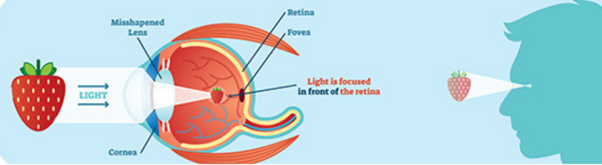
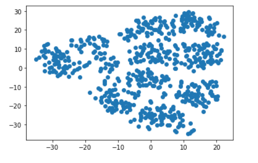
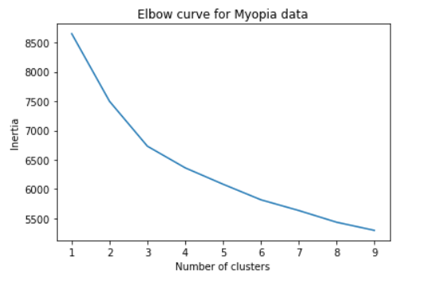
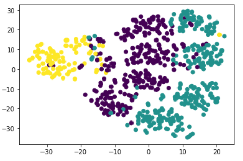

# Myopia-Clusters

We will apply unsupervised learning by fitting data to a model and using clustering algorithms to place data into groups. Then create a visualization that shares our findings.

## Analyzing: 

### Prepare the Data:
using jupyter notebook, NumPy, Pandas, Matplotlib, and Scikit-learn
data myopia.csv explored and cleaned 

### Apply Dimensionality Reduction:

using PCA dimensionality reduction the features have been reduced from 14 to 10 features.

No distinct clusters

from the plot it seems the elbow when k=3

### Perform a Cluster Analysis with K-means:

## Recomandation:
Based on findings patients can be clustered into  three cluster
 
 
